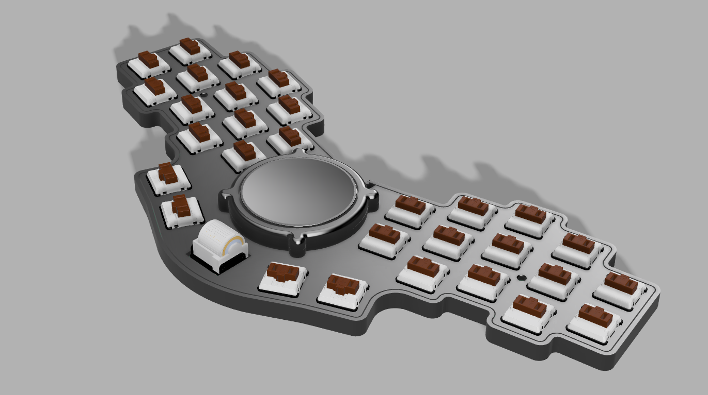

# Buteo

### A unibody split 30 key keyboard (23332 layout) with Cirque trackpad and encoder.

This is the first PCB I have ever designed, and it has been a really fun experience learning both KiCAD and Fusion 360.

I got the PCB made at JLCPCB, gerber files are in `buteo-mx/gerbers.zip`.

Case files (STLs and STEP) are also included.

I haven't written the firmware yet...

